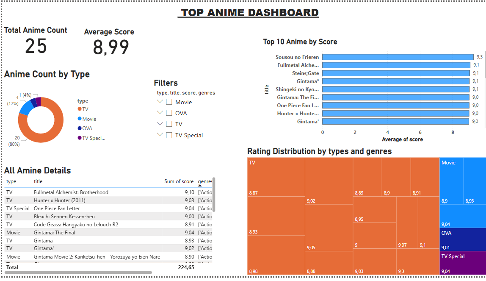

# 🧩 Anime ETL & Dashboard Project

A complete end-to-end ETL (Extract → Transform → Load) pipeline that sources anime data from the [Jikan API](https://jikan.moe), processes it using Python, stores it in MySQL, and visualizes insights in a Power BI dashboard.

---

## 🖼️ Dashboard Preview



---

## ⚙️ Project Workflow

This project is automated by a main pipeline script (`main.py`) that executes three core stages in order:

1.  **Extract (`scripts/data_collection.py`):** Connects to the Jikan REST API to fetch real-time data on the top anime shows. The raw data is saved to `data/raw/top_anime.csv`.

2.  **Transform (`scripts/data_cleaning.py`):** Reads the raw data, selects only the essential columns (`mal_id`, `title`, `type`, `score`, `genres`), and cleans the data for consistency. The processed data is saved to `data/processed/cleaned_anime.csv`.

3.  **Load (`scripts/load_to_db.py`):** Connects to a MySQL database, creates a clean `anime` table, and loads the transformed data into it for analysis.

---

## 💻 Technologies & Libraries

| Tool | Role in Project |
|---|---|
| Python 3.x | Writing and orchestrating the ETL pipeline |
| `requests`, `pandas` | Data extraction and transformation |
| `SQLAlchemy`, `PyMySQL` | Loading data into MySQL |
| MySQL Server | Central storage for structured data |
| Power BI Desktop | Creating the interactive dashboard |
| Git & GitHub | Version control and portfolio hosting |

---

## 🚀 How to Run the Entire Pipeline

### Prerequisites:
- Python 3.x installed
- MySQL Server installed and running
- Git installed

### Step-by-Step Setup:

1.  **Clone this repository:**
    ```bash
    git clone [https://github.com/Gourav180420/anime_project.git](https://github.com/Gourav180420/anime_project.git)
    cd anime_project
    ```

2.  **Create and activate a virtual environment (recommended):**
    ```bash
    # Create the environment
    python -m venv venv
    # Activate on Windows
    venv\Scripts\activate
    # Activate on macOS/Linux
    # source venv/bin/activate
    ```

3.  **Install the required Python packages:**
    ```bash
    pip install -r requirements.txt
    ```

4.  **Prepare database credentials:**
   - Make sure your MySQL user, password, and database name in `config.py` match your local setup.

5.  **Run the pipeline:**
   - Execute the main script from the root directory. This will run the entire ETL process.
    ```bash
    python main.py
    ```
6. **View the Dashboard:**
    - Connect Power BI to your `anime_db` in MySQL to see the live data.